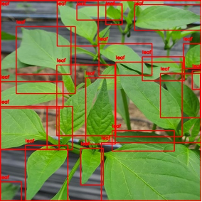
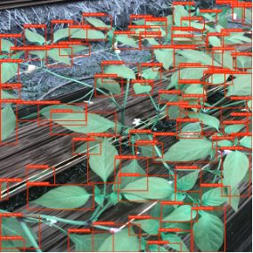
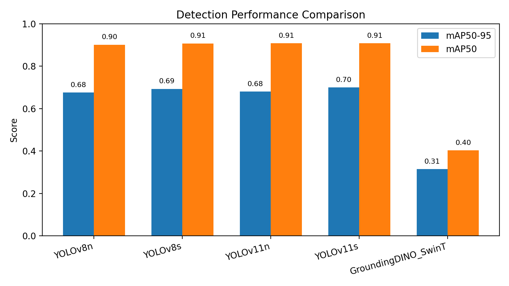
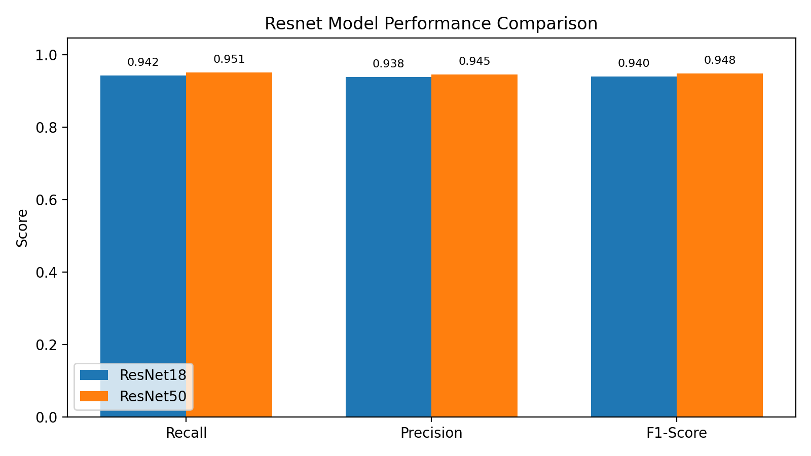

# Edge-Optimized Pepper Leaf Disease Detector

A lightweight, real-time computer vision system designed for the automated diagnosis of Korean pepper leaf diseases on edge devices (Raspberry Pi).

## Dataset

This project utilizes datasets provided by AI Hub (Korea Information Society Agency). We have obtained permission to distribute the processed version of the dataset used in this project.

You can download the pre-processed dataset (images resized to 640x640, annotated with Grounding DINO and YOLO) directly:
- **Processed Dataset:** [Download Link](https://drive.google.com/file/d/1rpqLOnmaRJqQnmmzvI4QcXY52M85mHnL/view?usp=share_link)

Please unzip the contents into the `data/` directory following the structure described in the repository.

## Repository Structure

- `data_prep/`: Scripts for data preprocessing and auto-labeling (Grounding DINO).
- `training/`: Training scripts for YOLO and ResNet.
- `export/`: Scripts to convert PyTorch models to TFLite/ONNX.
- `scripts/`: Main inference code for Raspberry Pi, including communication modules.
- `models/`: Stores the final deployed TFLite models.
- `assets/`: Demo images and performance graphs for documentation.

## Setup

### 1. Environment
Install the required dependencies:
```bash
pip install -r requirements.txt
```

### 2. Download Pretrained Models
Download the base weights required for training and auto-labeling into `models/pretrained/`.

**GroundingDINO (Swin-T) & Config** (Used for Auto-Labeling):
```bash
mkdir -p models/pretrained
wget -P models/pretrained https://github.com/IDEA-Research/GroundingDINO/releases/download/v0.1.0-alpha/groundingdino_swint_ogc.pth
wget -P models/pretrained https://raw.githubusercontent.com/IDEA-Research/GroundingDINO/main/groundingdino/config/GroundingDINO_SwinT_OGC.py
```

**YOLO Base Models** (v8n, v8s, v11n, v11s):
```bash
# YOLOv8 Nano
wget -P models/pretrained https://github.com/ultralytics/assets/releases/download/v8.2.0/yolov8n.pt
# YOLOv8 Small
wget -P models/pretrained https://github.com/ultralytics/assets/releases/download/v8.2.0/yolov8s.pt
# YOLO11 Nano
wget -P models/pretrained https://github.com/ultralytics/assets/releases/download/v8.3.0/yolo11n.pt
# YOLO11 Small
wget -P models/pretrained https://github.com/ultralytics/assets/releases/download/v8.3.0/yolo11s.pt
```

## Labeling Workflow
The labeling from AI Hub was insufficient, so we adopted a semi-automated pipeline:
1. **Grounding DINO**: Used for initial 1st-stage labeling.
2. **Manual Correction**: Corrected ~230 images using Roboflow.
3. **YOLOv11s**: Trained on the corrected 230 images to label the remaining ~160 images.
4. **Final Correction**: Manually verified the remaining labels.

### Labeling Examples

*Grounding DINO Labeling*


*YOLOv11s Labeling*

## Procedure


### 1. Data Preparation (Labeling)

If you wish to process raw data from scratch (instead of using the pre-processed download), follow this pipeline:


1.  **Auto-Labeling (Grounding DINO)**

    Generate initial bounding boxes for leaves.

    ```bash

    python data_prep/run_labeling_grounding_dino.py

    ```


2.  **Train Auto-Labeler (YOLO)**

    Train a YOLO model on verified data to label the rest.

    ```bash

    python data_prep/train_labeling_yolov11.py

    ```


### 2. Detection Pipeline (YOLO)


1.  **Download Data**

    - Download the processed dataset (already resized to 640x640).

    - *Link:* [Processed Dataset](https://drive.google.com/file/d/1rpqLOnmaRJqQnmmzvI4QcXY52M85mHnL/view?usp=share_link)

    - Unzip into `data/`:

      ```bash

      unzip <downloaded_file>.zip -d data/

      ```


2.  **Train YOLO**

    Train the detection model (e.g., YOLOv11n).

    ```bash

    python training/train_yolo.py --model yolo11n

    ```


### Detection Results




### 3. Classification Pipeline (ResNet)


1.  **Train ResNet**

    Train the disease classifier (ResNet18 or ResNet50).

    ```bash

    # Train ResNet18

    python training/train_resnet.py --arch resnet18

    

    # Train ResNet50

    python training/train_resnet.py --arch resnet50

    ```


### Classification Results




## Deployment & Inference


### 1. Export Models

Convert PyTorch models to TFLite for edge deployment.

```bash

python export/export_to_tflite.py --model-path runs/detection/trained_yolo11n.pt --output models/exported/yolov11n.tflite

```


### 2. Run Single Image Inference

Run the full detection + classification pipeline on a single image.

```bash

python scripts/detection_and_classification.py \

    --image <path_to_image.jpg> \

    --det-weights models/trained/trained_yolov8s.pt \

    --cls-weights models/trained/trained_resnet18.pth

```


### 3. Run Batch Inference

Process a directory of images for detection or classification separately.

```bash

# Run Detection on a folder

python scripts/run_detection.py --source <path_to_images_folder>


# Run Classification on a folder of crops

python scripts/run_classification.py --source <path_to_crops_folder>

```