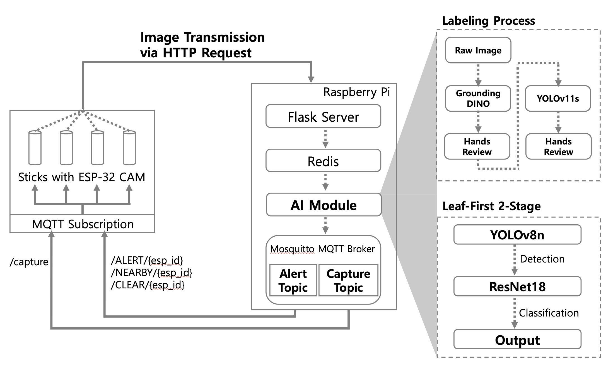

# Edge-Optimized Pepper Leaf Disease Detector
# (엣지 디바이스 최적화 고추 잎 병해 진단 시스템)

[[English]](#English) [[Korean]](#Korean)

---

<a name="English"></a>
## **English**

This repository provides the official implementation and reproducibility resources for the **Edge-Optimized Pepper Leaf Disease Detector**. 

### **Abstract**
Manual inspection of agricultural crops, specifically Korean pepper leaves, is labor-intensive and prone to human error. This project introduces a lightweight, real-time computer vision system designed for edge computing environments (Raspberry Pi & ESP32). 

Unlike traditional server-based approaches, our system executes the entire **Detection (YOLOv8)** and **Classification (ResNet-18)** pipeline locally on the device. To address data scarcity, we developed a semi-automated labeling pipeline using **Grounding DINO** and **YOLOv11**, significantly reducing the manual workload required to build the dataset. The final models are quantized to **TensorFlow Lite**, ensuring efficient inference with minimal latency.

---

### **System Architecture & Performance**

<p align='center'>
  
</p>
<p align='center'>Fig 1. Overall System Architecture and Data Flow.</p>

The system operates on a distributed IoT architecture:
1.  **Image Capture Agent (ESP32)**: Captures images and uploads them via HTTP.
2.  **Inference Server (Raspberry Pi)**: Queues images in Redis, processes them with TFLite models, and publishes alerts via MQTT.

#### **Model Performance**
We evaluated various architectures to balance speed and accuracy.

| Metric | YOLOv8n (Nano) | YOLOv8s (Small) | ResNet-18 | ResNet-50 |
| :--- | :---: | :---: | :---: | :---: |
| **Role** | Detection | Detection | Classification | Classification |
| **Inference (Pi 4)** | ~150ms | ~300ms | ~40ms | ~90ms |
| **Status** | **Deployed** | Comparison | **Deployed** | Comparison |

<p align='center'>
  
  
</p>
<p align='center'>Fig 2. Performance benchmarks for Detection (Left) and Classification (Right) models.</p>

---

### **Reproducibility**

#### **1. Environment Setup**
Install the required dependencies:
```bash
pip install -r requirements.txt
```

#### **2. Download Pretrained Models**
Download the base weights required for training and auto-labeling into `models/pretrained/`.
```bash
# Create directory
mkdir -p models/pretrained

# Download GroundingDINO (for Auto-Labeling)
wget -P models/pretrained https://github.com/IDEA-Research/GroundingDINO/releases/download/v0.1.0-alpha/groundingdino_swint_ogc.pth
wget -P models/pretrained https://raw.githubusercontent.com/IDEA-Research/GroundingDINO/main/groundingdino/config/GroundingDINO_SwinT_OGC.py

# Download YOLOv8n (for Detection)
wget -P models/pretrained https://github.com/ultralytics/assets/releases/download/v8.2.0/yolov8n.pt
```

#### **3. Dataset & Preparation**
Due to licensing, we provide the pre-processed version of the dataset used in this research.
- **Download**: [Processed Dataset (Google Drive)](https://drive.google.com/file/d/1rpqLOnmaRJqQnmmzvI4QcXY52M85mHnL/view?usp=share_link)
- **Action**: Unzip the contents into the `data/` directory.

#### **4. Training Workflow**
You can reproduce the training results using the scripts in the `training/` directory.

```bash
# Train the Object Detector (YOLOv8 Nano)
python training/train_yolo.py --model yolo8n

# Train the Disease Classifier (ResNet-18)
python training/train_resnet.py --arch resnet18
```

#### **5. Semi-Automated Labeling**
If you wish to replicate the labeling process on raw data:
- **Step 1**: Auto-label using Grounding DINO.
  ```bash
  python data_prep/run_labeling_grounding_dino.py
  ```
- **Step 2**: Refine labels using a small trained YOLO model.
  ```bash
  python data_prep/train_labeling_yolov11.py
  ```

#### **6. Edge Deployment**
To run the inference engine on a Raspberry Pi:
```bash
# Start the Inference Worker
python deploy/raspberry_pi/image_dispatcher_worker.py
```

---

### **Resources**

- **Pre-trained Models**: Located in `models/exported/` (TFLite format).
- **Source Code**:
    - [Preprocessing](data_prep/)
    - [Training](training/)
    - [Edge Deployment](deploy/)

---
---

<a name="Korean"></a>
## **Korean (한국어)**

이 레포지토리는 **엣지 디바이스 최적화 고추 잎 병해 진단 시스템**의 공식 구현 및 재현을 위한 리소스를 제공합니다.

### **연구 개요 (Abstract)**
고추 잎의 병해를 육안으로 검사하는 것은 많은 노동력이 소요되며 오진의 가능성이 있습니다. 본 프로젝트는 엣지 컴퓨팅 환경(Raspberry Pi 및 ESP32)에서 실시간으로 작동하는 경량 컴퓨터 비전 시스템을 제안합니다.

기존의 서버 기반 접근 방식과 달리, 본 시스템은 **탐지(YOLOv8)** 및 **분류(ResNet-18)** 의 전체 파이프라인을 디바이스 내부에서 로컬로 처리합니다. 데이터 부족 문제를 해결하기 위해 **Grounding DINO**를 활용한 반자동 라벨링 파이프라인을 구축하여 데이터셋 구축에 드는 노력을 획기적으로 줄였습니다. 최종 모델은 **TensorFlow Lite**로 양자화되어 엣지 디바이스에서도 낮은 지연 시간으로 추론이 가능합니다.

---

### **시스템 아키텍처 및 성능**

<p align='center'>
  
</p>
<p align='center'>그림 1. 시스템 전체 아키텍처 및 데이터 흐름.</p>

이 시스템은 분산 IoT 아키텍처를 기반으로 작동합니다:
1.  **이미지 수집 에이전트 (ESP32)**: 이미지를 촬영하고 HTTP를 통해 업로드합니다.
2.  **추론 서버 (Raspberry Pi)**: Redis 큐를 통해 이미지를 수신하고, TFLite 모델로 처리한 후 MQTT를 통해 알림을 전송합니다.

#### **모델 성능**
속도와 정확도의 균형을 맞추기 위해 다양한 아키텍처를 평가했습니다.

| 지표 | YOLOv8n (Nano) | YOLOv8s (Small) | ResNet-18 | ResNet-50 |
| :--- | :---: | :---: | :---: | :---: |
| **역할** | 병해 탐지 | 병해 탐지 | 질병 분류 | 질병 분류 |
| **추론 속도 (Pi 4)** | ~150ms | ~300ms | ~40ms | ~90ms |
| **상태** | **배포됨** | 비교군 | **배포됨** | 비교군 |

<p align='center'>
  
  
</p>
<p align='center'>그림 2. 탐지(좌) 및 분류(우) 모델의 성능 벤치마크</p>

---

### **재현성 (Reproducibility)**

#### **1. 환경 설정 (Environment Setup)**
필요한 라이브러리를 설치합니다:
```bash
pip install -r requirements.txt
```

#### **2. 사전 학습된 모델 다운로드 (Download Pretrained Models)**
학습 및 자동 라벨링에 필요한 기본 가중치 파일을 `models/pretrained/` 경로에 다운로드합니다.
```bash
# 디렉토리 생성
mkdir -p models/pretrained

# GroundingDINO 다운로드 (자동 라벨링용)
wget -P models/pretrained https://github.com/IDEA-Research/GroundingDINO/releases/download/v0.1.0-alpha/groundingdino_swint_ogc.pth
wget -P models/pretrained https://raw.githubusercontent.com/IDEA-Research/GroundingDINO/main/groundingdino/config/GroundingDINO_SwinT_OGC.py

# YOLOv8n 다운로드 (탐지 모델용)
wget -P models/pretrained https://github.com/ultralytics/assets/releases/download/v8.2.0/yolov8n.pt
```

#### **3. 데이터셋 및 준비**
라이선스 문제로 인해, 본 연구에 사용된 전처리된 데이터셋을 제공합니다.
- **다운로드**: [전처리된 데이터셋 (Google Drive)](https://drive.google.com/file/d/1rpqLOnmaRJqQnmmzvI4QcXY52M85mHnL/view?usp=share_link)
- **실행**: 다운로드한 파일을 `data/` 디렉토리에 압축 해제하십시오.

#### **4. 학습 워크플로우**
`training/` 디렉토리의 스크립트를 사용하여 학습 결과를 재현할 수 있습니다.

```bash
# 객체 탐지 모델 학습 (YOLOv8 Nano)
python training/train_yolo.py --model yolo8n

# 질병 분류 모델 학습 (ResNet-18)
python training/train_resnet.py --arch resnet18
```

#### **5. 반자동 라벨링**
원본 데이터를 사용하여 라벨링 과정을 재현하려면 다음 단계를 따르십시오:
- **1단계**: Grounding DINO를 사용한 자동 라벨링
  ```bash
  python data_prep/run_labeling_grounding_dino.py
  ```
- **2단계**: 학습된 소형 YOLO 모델을 사용한 라벨 정제
  ```bash
  python data_prep/train_labeling_yolov11.py
  ```

#### **6. 엣지 배포**
라즈베리 파이에서 추론 엔진을 실행하려면:
```bash
# 추론 워커 시작
python deploy/raspberry_pi/image_dispatcher_worker.py
```

---

### **리소스**

- **사전 학습된 모델**: `models/exported/` 경로에 TFLite 포맷으로 저장되어 있습니다.
- **소스 코드**:
    - [전처리 (Preprocessing)](data_prep/)
    - [학습 (Training)](training/)
    - [엣지 배포 (Edge Deployment)](deploy/)

---